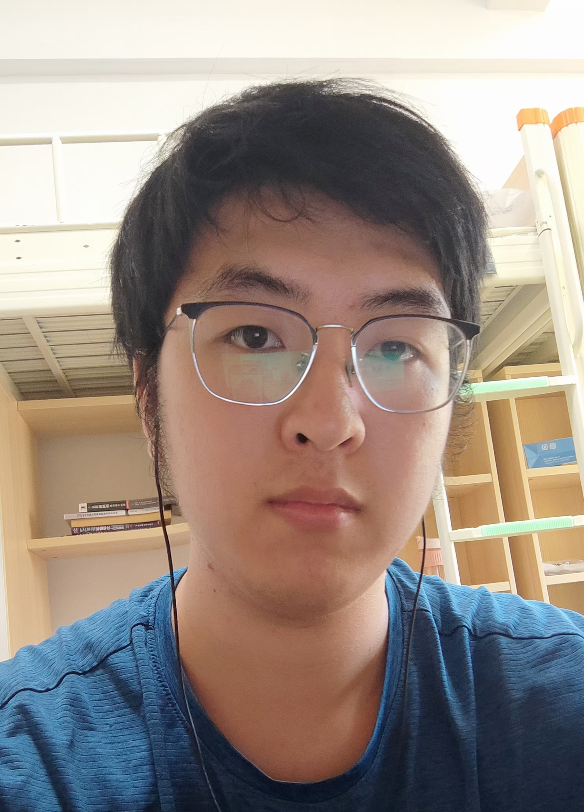

# About Me

<!--  -->

Here is **Yibo Ma (马義波)**. 

Starting in September 2025, I will begin my Ph.D. journey at the School of Informatics, University of Edinburgh, as a member of the [Networked Systems (NetSys) Group](https://netsys.inf.ed.ac.uk/), supervised by [Prof. Mahesh K. Marina](https://homepages.inf.ed.ac.uk/mmarina/). I earned my M.S. degree at Tsinghua University under the guidance of [Prof. Yong Li](https://fi.ee.tsinghua.edu.cn/~liyong/), where my thesis received the Outstanding Thesis Award. Before that, I completed my B.S. degree at Tongji University, advised by [Prof. Yaobao Yin](https://mefaculty.tongji.edu.cn/info/1296/3241.htm).

I am passionate about all aspects of Networking and Artificial Intelligence, and I am currently preparing to relocate to the United Kingdom for my Ph.D. studies. If you are interested in my research or potential collaborations, I am always open to discussion and new ideas. Feel free to reach out to me at mayibo2hyh [at] gmail.com.

Here is my Resume: [Resume](./file/CV-Yibo_Ma.pdf)

---

## Research Interests

- Network Digital Twinning
- Optimization of Energy Efficiency in Mobile Networks
- Data-driven and AI-based Approaches for Networking

My research envolves **measurement, simulation, and optimization of networked systems**, making advanced algorithms deployable in real-world networks. I specialize in **Network Digital Twin technology** to enhance the performance and sustainability of **large-scale networked systems**, such as mobile networks and geo-distributed data centers. I analyze real-time operational data, simulate system dynamics, and develop optimization algorithms to reduce energy consumption and carbon emissions. Additionally, I am deeply interested in **applying machine learning techniques to enhance network performance**.

---

## News and Updates

- **May 2025：**🎉 Successfully defended my Master’s thesis and was awarded the Outstanding Master’s Thesis by Tsinghua University (top 1 among 30+ students).
- **Dec 2024：**🎤 Presented my work “Sustainable Connections: Exploring Energy Efficiency in 5G Networks” at ACM CoNEXT 2024, receiving great discussions and feedback—thanks for the interest!
- **Aug 2024：**🎉 *The 2nd Research Summit of Urban Science and Human Dynamics* was successfully held at Tsinghua University!
- **July 2024：**I completed the defense of the practice report in Guiyang.
- **July 2024：**🎉 Our paper was accepted by *ACM CoNEXT 2024*. See you in Los Angeles!
- **Jun 2024：**🎉 Our paper was accepted by *IEEE TNSM*.

 
